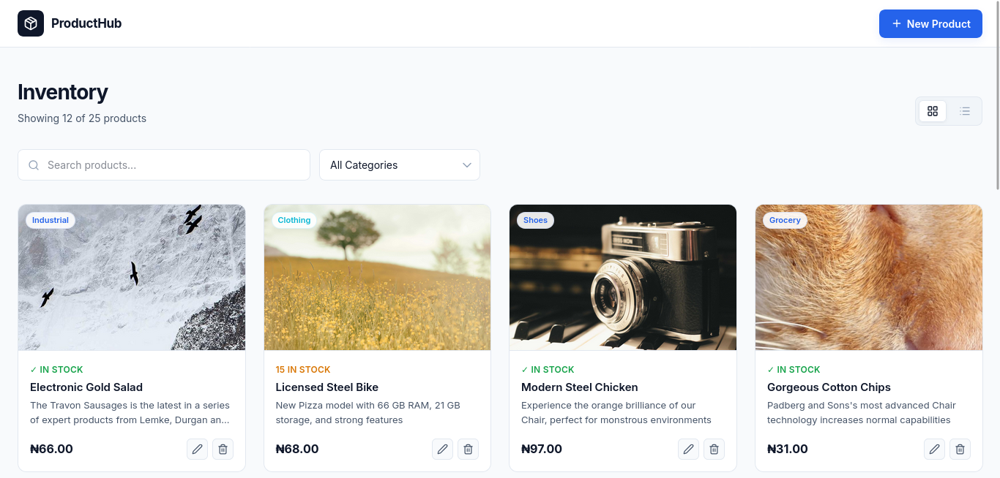
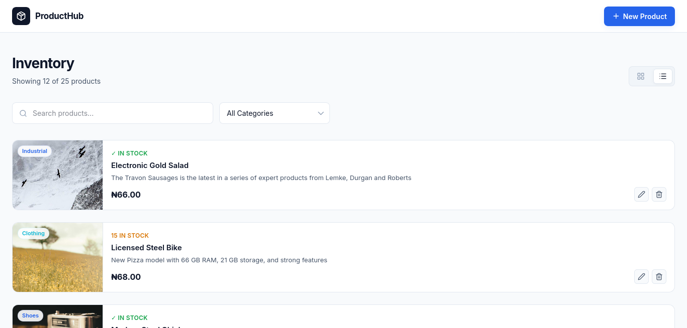
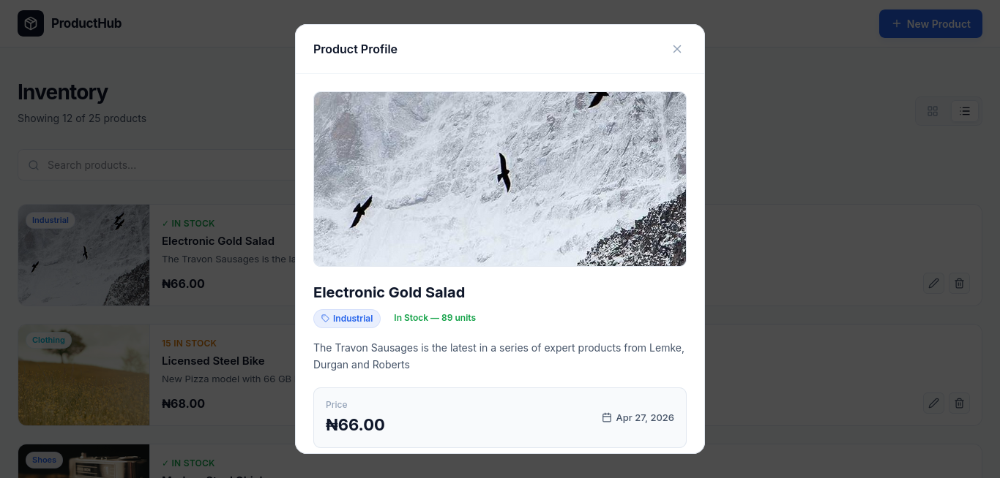
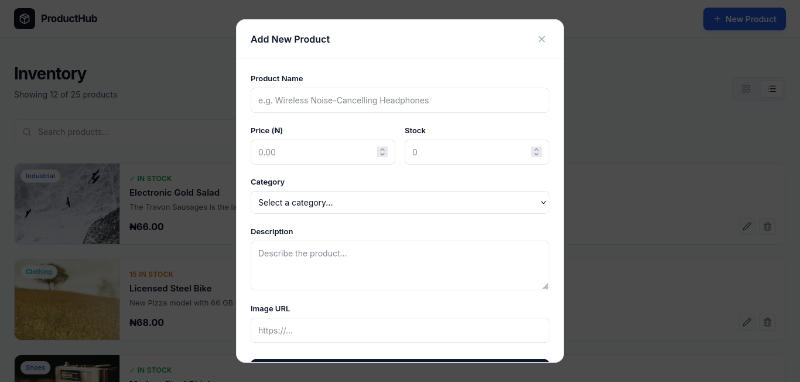

# ProductHub — Product Management Dashboard

A responsive, modern B2B Product Management Dashboard built with **Next.js 16**, **TypeScript**, and **Tailwind CSS v4**.

## Features

- **Full CRUD** — Create, read, update, and delete products via a mock REST API
- **Live Search & Filtering** — Filter by name or category in real time
- **Grid / List View Toggle** — Switch between card grid and compact list layout
- **Pagination** — Smart paginator with ellipsis for large catalogues
- **Form Validation** — Zod-powered schema validation with react-hook-form
- **Skeleton Loaders** — Animated placeholders during data fetching
- **Naira (₦) Currency Formatting** — Locale-aware `en-NG` number formatting
- **Keyboard Accessible Modals** — Escape-to-close and backdrop-click dismiss

## Tech Stack

| Layer | Technology |
|-------|-----------|
| Framework | Next.js 16 (App Router) |
| Language | TypeScript 5 |
| Styling | Tailwind CSS v4 |
| Data Fetching | TanStack React Query v5 |
| HTTP Client | Axios |
| Forms | React Hook Form v7 |
| Validation | Zod v4 |
| Icons | Lucide React |

## Setup Instructions

### Prerequisites
- Node.js 18+ 
- npm 9+

### Installation

```bash
# 1. Clone the repository
git clone <your-repo-url>
cd product-mgt

# 2. Install dependencies
npm install

# 3. Start the development server
npm run dev
```

Open [http://localhost:3000](http://localhost:3000) in your browser.

### Build for Production

```bash
npm run build
npm start
```

## Project Structure

```
product-mgt/
├── app/
│   ├── globals.css          # Tailwind v4 @theme config + global styles
│   ├── layout.tsx           # Root layout
│   └── page.tsx             # Main dashboard page
├── components/
│   ├── features/products/
│   │   ├── ProductCard.tsx  # Grid/list product card
│   │   ├── ProductDetail.tsx # Product detail modal view
│   │   ├── ProductForm.tsx  # Create/edit form with validation
│   │   └── DeleteDialog.tsx # Delete confirmation dialog
│   └── ui/
│       ├── Modal.tsx        # Reusable modal wrapper
│       └── Skeleton.tsx     # Loading skeleton component
├── hooks/
│   └── useProducts.ts       # React Query hooks for CRUD
├── lib/
│   └── api.ts               # Axios API client
└── types/
    └── product.ts           # TypeScript product interfaces
```

## Technical Decisions

### Tailwind CSS v4
Tailwind v4 is configured directly in `globals.css` using the new `@theme` block — no `tailwind.config.js` required. Custom design tokens (colors, spacing) are defined as CSS variables and natively available as utility classes.

### TanStack React Query
All server state is managed with React Query. `useGetProducts` fetches the full catalogue once and stores it in cache — search and category filtering happen entirely client-side for a snappy, zero-latency UX.

### Zod + React Hook Form
Form validation uses a Zod schema as the single source of truth, integrated via `@hookform/resolvers/zod`. This ensures type-safe form values that exactly match the API payload shape.

### Mock API
The dashboard integrates with the [DummyJSON Products API](https://dummyjson.com/products) with field mapping to align the external shape with the internal `Product` type.

## Screenshots

> Add screenshots here before submission.

Gallery (images are served from the `public` folder):

<p align="center">
    
    
</p>

<p align="center">
    
    
</p>
